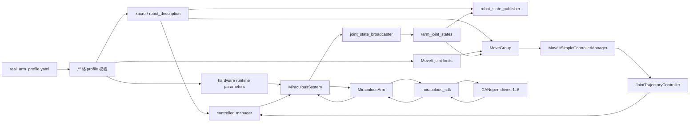
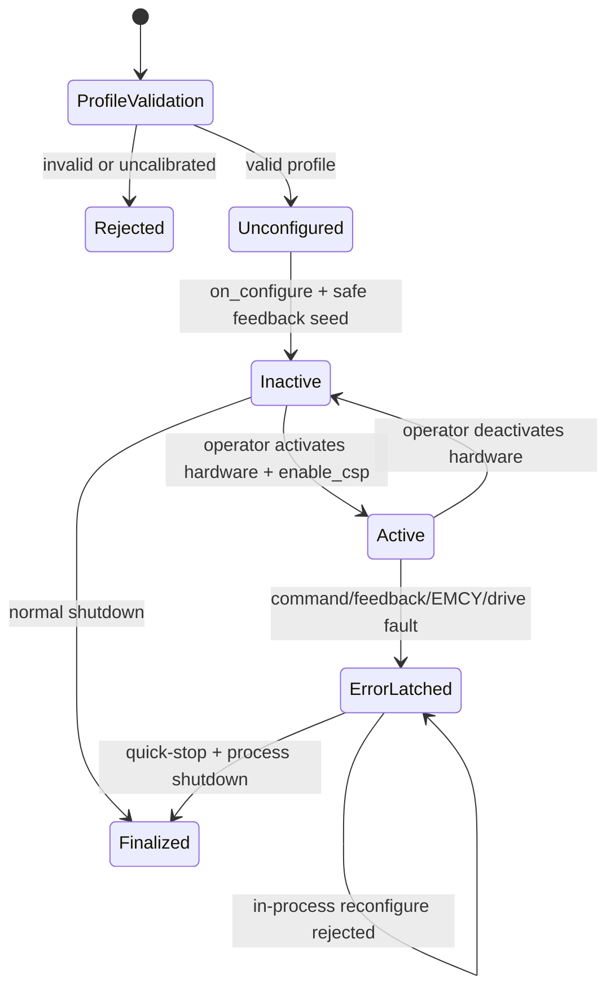
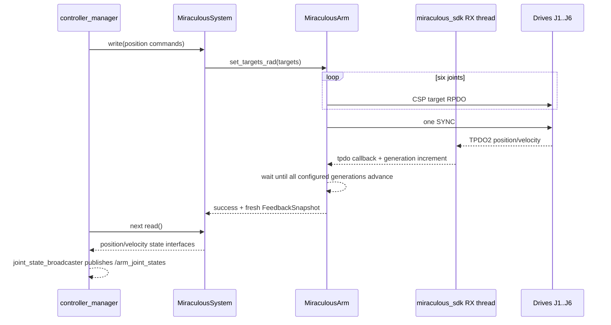
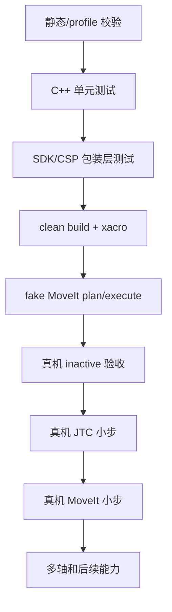

# MoveIt 真机接入总体设计与测试基线

更新日期：2026-08-05
审查起点：`96a2282 Save real-arm hardware test profile`

## 1. 文档目的

本文记录 Miraculous 六轴机械臂接入 MoveIt 2 的整体设计，不是单纯的启动
命令清单。它回答以下问题：

1. MoveIt、ros2_control、`MiraculousSystem`、`MiraculousArm` 和 SDK 各自负责
   什么。
2. 规划目标如何变成六轴 CANopen CSP 目标。
3. TPDO2 反馈如何返回 MoveIt，并如何判断“新鲜”。
4. launch 为什么不会自动使能真机。
5. 写失败、反馈超时和 EMCY 如何触发停机并锁存。
6. 离线测试、fake 测试和真机测试分别验证哪一层。
7. 后续真机测试应以哪个 Git 提交为起点、保存哪些证据。

实际操作步骤见：

- `docs/MOVEIT_REAL_BRINGUP.md`
- `miraculous_driver/docs/REAL_HARDWARE_BRINGUP.md`
- `miraculous_driver/docs/TEACH_HARDWARE_TEST_GUIDE.md`

## 2. 当前范围

### 2.1 本阶段包含

- 单臂六关节 `J1..J6`。
- CANopen node `1..6` 到 `J1..J6` 的一一映射。
- MoveIt 关节空间规划。
- `FollowJointTrajectory` 执行。
- position command interface。
- position/velocity state interfaces。
- 50 Hz ros2_control 更新周期。
- 手动 SYNC CSP。
- 完整六轴 fresh TPDO2 等待。
- 人工激活、人工停机和故障后进程重启。
- 当前姿态相对单轴小步 MoveIt smoke test。

### 2.2 本阶段不包含

- 真实 TCP 标定；`tool0` 仍是零偏移占位。
- 真机位姿目标和笛卡尔路径执行。
- 碰撞场景中的动态障碍物感知。
- RGB-D/点云 octomap updater。
- 自动 fault reset 或 ROS reset service。
- effort/torque 控制。
- 真实 jerk、effort 和动力学参数验收。
- 双臂协调。

在上述内容完成前，不能因为 MoveIt 能规划就直接扩大到笛卡尔或多轴大范围运动。

## 3. 核心设计原则

### 3.1 Fail closed

缺少标定、配置格式错误、反馈不新鲜或命令不安全时，系统必须拒绝继续，而不是
使用默认值猜测。

生产 profile 已填入待验收的暂定限位和看门狗，但初始状态仍是：

```yaml
calibrated: false
```

`moveit_real.launch.py` 使用 `require_calibrated=True` 加载它。因此暂定数值尚未完成
六轴真机复核时，launch 在创建硬件节点前就失败；不能仅为了启动而改成 `true`。

### 3.2 单一真机配置源

真机 node id、位置限位、规划速度/加速度和通信时序统一来自：

```text
miraculous_driver/config/real_arm_profile.yaml
```

launch 从这份 profile 同时派生：

- xacro/ros2_control hardware parameters；
- `MiraculousSystem` 的驱动侧软件限位；
- MoveIt `robot_description_planning.joint_limits`；
- controller manager update rate。

这样可以避免 MoveIt 认为目标合法、驱动却使用另一套限位的配置漂移。

### 3.3 启动不等于使能

真机 launch 只负责把软件栈准备好，不代表允许运动：

- `ARMSystem` 初始状态：`inactive`；
- `joint_state_broadcaster`：`active`；
- `arm_controller`：`inactive`；
- MoveGroup/RViz：可以启动。

必须由操作员先激活硬件，再激活轨迹控制器。

### 3.4 闭环状态来自编码器

真实 `arm_controller` 配置为：

```yaml
open_loop_control: false
set_last_command_interface_value_as_state_on_activation: false
```

控制器不能把上一条命令伪装成当前状态。MoveIt 当前状态、JTC tracking error 和
执行结果都必须建立在 ros2_control 发布的编码器反馈上。

### 3.5 不自动复位故障

任何 active 状态故障都会：

1. arm-wide quick-stop，并逐轴确认 `Quick Stop Active`；
2. 故障锁存；
3. ros2_control 返回 `ERROR`；
4. 禁止当前进程重新 configure/activate；
5. 要求外部工具或断电流程复位驱动器；
6. 重启 controller manager/launch。

没有自动 fault reset，也没有 ROS reset service。

## 4. 分层职责

| 层 | 主要职责 | 不负责 |
|---|---|---|
| MoveIt | 读取当前状态、碰撞检查、OMPL 规划、时间参数化、发执行请求 | CAN 通信、驱动器状态机 |
| MoveItSimpleControllerManager | 把 MoveIt trajectory 交给 `arm_controller/follow_joint_trajectory` | 插值和硬件写入 |
| JointTrajectoryController | 按时间插值、检查 tracking/goal tolerance、写 position command interfaces | CANopen/CSP 事务 |
| controller_manager | 执行 read-update-write 循环、管理硬件和控制器生命周期 | 机械臂协议细节 |
| MiraculousSystem | ROS joint 到硬件数组的映射、参数校验、反馈 watchdog、命令限位、故障锁存 | 直接解析 CAN 帧 |
| MiraculousArm | 六轴 SDK handle、CiA402/CSP 事务、RPDO/SYNC/TPDO freshness、quick-stop | MoveIt 规划 |
| miraculous_sdk | SocketCAN、CANopen master、PDO/SDO、接收线程、单位转换 | ROS 生命周期 |
| 驱动器/电机 | 执行 CSP 位置控制、硬件保护、编码器反馈 | ROS/MoveIt 语义 |

## 5. 总体架构



## 6. 启动与生命周期设计

### 6.1 launch 前置校验

`moveit_real.launch.py` 的 `OpaqueFunction` 首先读取 profile。它检查：

- schema version；
- 顶层、hardware 和 joint keys 是否完整且无多余项；
- `calibrated` 是否为 true；
- 是否恰好包含 `J1..J6`；
- node id 是否唯一且在 `1..127`；
- 每轴 `position_min < position_max`；
- 真机限位是否位于 URDF 外层限位内；
- velocity/acceleration 是否为有限正数；
- feedback timeout 和 stale timeout 的大小关系。

任何一项失败都抛出 launch error，此时 CAN 尚未打开。

### 6.2 inactive 配置阶段

profile 通过后：

1. `robot_state_publisher` 发布同一份 real robot description。
2. controller manager 通过 `/robot_description` 获取模型。
3. `hardware_components_initial_state.inactive` 使 `ARMSystem` 只执行
   `on_init()` 和 `on_configure()`，不执行 `on_activate()`。
4. `MiraculousSystem::on_configure()`：
   - 严格解析硬件参数；
   - 检查完整六轴映射和软件限位；
   - 构造 `MiraculousArm`；
   - 打开 SDK handles；
   - 完成一次性的 CSP PDO/SYNC 配置；
   - 启动后台反馈线程；
   - 等待完整、有限、未越限的反馈快照；
   - 用实测位置播种 state 和 command interfaces。
5. 此阶段不会调用 `enable_csp()`，驱动器不会进入 Operation Enabled。
6. `arm_controller` 仅加载/configure 为 inactive。

ROS 2 Humble 在硬件 inactive 时不应被当作持续实时采样阶段。
`/arm_joint_states` 至少包含 configure 时的安全快照；真正激活前，
`on_activate()` 会再次直接读取 `MiraculousArm` 的最新快照并重新播种。

### 6.3 人工激活

操作顺序固定为：

```text
ARMSystem inactive
  -> operator activates ARMSystem
  -> MiraculousSystem::on_activate()
  -> fresh snapshot check
  -> MiraculousArm::enable_csp()
  -> current-position CSP seed
  -> all six drives Operation Enabled
  -> post-enable fresh snapshot
  -> ARMSystem active
  -> operator activates arm_controller
  -> arm_controller active
```

不能先激活 `arm_controller` 再激活硬件。

### 6.4 正常停机

正常停机使用反向顺序：

```text
deactivate arm_controller
  -> deactivate ARMSystem
  -> MiraculousArm::disable()
  -> Ctrl-C launch
  -> external electrical power-down procedure
```

`on_shutdown()` 在硬件仍 active 时会先 quick-stop；最终 teardown 会逐轴命令并确认
`Switch On Disabled`，再关闭 SDK 句柄。

### 6.5 生命周期状态图



## 7. MoveIt 命令数据流

### 7.1 规划阶段

1. MoveIt 从 `/arm_joint_states` 建立当前 RobotState。
2. 用户给出关节目标。
3. OMPL 在 SRDF group `single_arm` 中规划。
4. request adapter 做时间参数化。
5. real launch 注入 profile 中的：
   - position limits；
   - max velocity；
   - max acceleration。
6. plan-only 时到此结束，不触发控制器 action。

### 7.2 执行阶段

```text
MoveGroupInterface::execute(plan)
  -> MoveGroup execute_trajectory
  -> MoveItSimpleControllerManager
  -> /arm_controller/follow_joint_trajectory
  -> JointTrajectoryController
  -> position command interfaces J1..J6
  -> controller_manager::write()
  -> MiraculousSystem::write()
  -> MiraculousArm::set_targets_rad()
  -> miraculous_motor_csp_set_target_ex() x 6
  -> one shared miraculous_motor_sync_send()
  -> drives latch six targets on the same SYNC edge
```

### 7.3 50 Hz 控制周期

controller manager 的逻辑周期是：

```text
read
  -> controller update
  -> write
```

对应本项目：

1. `MiraculousSystem::read()` 复制最新 `FeedbackSnapshot`。
2. 检查：
   - snapshot 是否存在；
   - timestamp 是否有效；
   - active 时是否超过 30 ms；
   - position/velocity 是否有限；
   - position 是否仍在软件限位内；
   - EMCY/drive fault 是否锁存。
3. JTC 根据 trajectory 时间和实际状态更新六轴 command interfaces。
4. `MiraculousSystem::write()` 再次检查每条命令：
   - finite；
   - 软件限位；
   - fault 状态；
   - 相对上一个已接受目标的单周期变化不超过 `0.005 rad`。
5. `MiraculousArm::set_targets_rad()` 依次写 RPDO target；任一写失败立即停止后续
   写入、抑制本周期 SYNC、quick-stop并隔离 SDK I/O。
6. 只有六轴 RPDO 全部成功时，手动 SYNC 模式才发送一次统一 SYNC。
7. 同一次调用等待六轴 fresh TPDO2，最长 15 ms。
8. 完整反馈到达后更新 snapshot，并监督 commanded-actual 跟踪误差；超过
   `0.05 rad` 达 3 个不同 fresh feedback 周期即停机。

如果第 5～7 步任一失败，`write()` 返回 `ERROR` 并进入故障停机。

## 8. 反馈数据流和 freshness 语义



### 8.1 15 ms manual feedback timeout

`manual_feedback_timeout_ms=15` 表示 driver-owned SYNC 之后，等待六轴完整新一代
TPDO2 的最大时间。

它不是固定 sleep。最后一轴到达时 condition variable 会立即唤醒。

超时表示“驱动没有在 deadline 前观察到完整 callback generation set”，不能单独
证明 CAN 线上的物理响应一定超过 15 ms。问题也可能在：

- SDK 接收线程调度；
- TPDO callback；
- 节点缺帧；
- 系统负载；
- callback generation/condition-variable 路径。

### 8.2 30 ms stale watchdog

`feedback_stale_timeout_ms=30` 是 ros2_control active 状态的端到端保护。

即使某次 read 还能拿到旧 cache，只要 snapshot timestamp 超过 30 ms，就会
quick-stop。它覆盖的是“控制系统是否还在持续获得完整反馈”，不是单帧等待。

### 8.3 snapshot 原子语义

`FeedbackSnapshot` 同时包含：

- sequence；
- steady-clock timestamp；
- 六轴 positions；
- 六轴 velocities。

position 和 velocity 在同一个 mutex 下复制，避免分别读取两个 cache 时得到不同
周期的数据组合。

## 9. 并发和 SDK 所有权

### 9.1 SDK 接收线程

CAN 接收和 TPDO dispatch 由 miraculous_sdk 的接收线程负责。driver 不覆盖
SDK 的 bus receive callback。

EMCY 使用 SDK 专用 EMCY callback。禁止调用通用
`miraculous_can_set_recv_callback()` 覆盖 master RX dispatcher，否则会同时破坏
TPDO cache、heartbeat 和 EMCY。

### 9.2 `sdk_mutex_`

所有主动 SDK I/O 事务使用 `sdk_mutex_` 串行化，包括：

- CSP enable transaction；
- target write + SYNC + feedback wait；
- disable；
- quick-stop；
- passive feedback acquisition。

### 9.3 `exclusive_sdk_io_`

active manual CSP 时，完整控制周期由 `set_targets_rad()` 所有。后台 read thread
不能并发发送额外 SYNC 或覆盖该周期反馈。

CSP enable 期间也保持 exclusive ownership，防止后台反馈 SYNC 插入
“读当前位置—写 seed—Enable Operation”事务。

### 9.4 EMCY 跨线程传递

SDK RX thread 中的 EMCY callback 只做轻量操作：

1. 设置 atomic latch；
2. 记录错误信息。

下一次 ros2_control read/write 周期观察 latch，执行 quick-stop。50 Hz 下
名义响应是一个控制周期量级，但它不是 safety-rated 硬实时急停，现场硬件急停
仍是最终保护。

## 10. 故障数据流

触发条件包括：

- `enable_csp()` 事务失败；
- command 为 NaN/Inf；
- command 超出 profile position limits；
- SDK target write 失败；
- manual SYNC 失败；
- 15 ms 内未收齐 fresh TPDO2；
- 单周期目标变化超过 `0.005 rad`；
- commanded-actual 误差超过 `0.05 rad` 达 3 个 fresh 周期；
- feedback snapshot 超过 30 ms；
- feedback position/velocity 非有限；
- actual position 越限；
- EMCY；
- drive fault；
- disable 失败。

故障路径：

```text
failure detected
  -> MiraculousSystem::fail_safe_stop(reason)
  -> active = false
  -> fault_latched = true
  -> arm layer immediate quick-stop + per-axis state verification
  -> system layer may make one best-effort retry
  -> read/write returns ERROR
  -> ros2_control error transition
  -> callback cleared
  -> SDK shutdown
  -> in-process configure rejected
  -> external reset + process restart required
```

上述路径描述已经进入 enable/active 事务后的运行时故障。profile 校验失败或
`on_configure()` 在使能前发现初始反馈越限时，系统直接拒绝配置并关闭 SDK；
因为驱动器尚未进入 Operation Enabled，不把这类前置拒绝伪装成一次成功运行后的
quick-stop。

`stop_issued_` 保证 ros2_control 上层不会在后续控制周期不断重发 quick-stop。对于
RPDO/反馈事务内部故障，`MiraculousArm` 会先立即 quick-stop，上层允许再做一次
best-effort 重试，避免底层某次停机写失败后完全没有第二次机会。

如果 quick-stop 命令或任何一轴的最终状态确认失败，日志会明确打印 failure；此时
必须依赖现场急停/断能，不能继续通过 ROS 重试。

## 11. 配置传播

### 11.1 profile 到 ros2_control

| profile 字段 | ros2_control/driver 用途 |
|---|---|
| `can_interface` | SocketCAN interface |
| `baudrate` | CANopen baudrate；`0` 表示沿用 SocketCAN 接口当前配置，不要求 SDK 修改波特率 |
| `encoder_bw` | SDK radian conversion |
| `reduction_ratio` | load-side velocity conversion |
| `sync_period_us` | `0` 表示 driver-owned manual SYNC |
| `controller_update_rate_hz` | controller manager update rate |
| `read_rate_hz` | background feedback loop |
| `state_poll_rate_hz` | statusword SDO polling；当前为 0 |
| `manual_feedback_timeout_ms` | 单次 SYNC fresh TPDO2 deadline |
| `feedback_stale_timeout_ms` | active feedback watchdog |
| `enable_emcy_monitor` | SDK EMCY callback |
| `max_command_step_rad` | 写 RPDO 前的单周期目标跳变上限 |
| `max_following_error_rad` | Driver commanded-actual 跟踪误差上限 |
| `following_error_cycles` | 连续超差的 fresh feedback 周期数 |
| `node_id` | CANopen node mapping |
| `position_min/max` | driver-side command/actual-position guard |

Driver 在任何 CAN 节点打开前校验 `miraculous_sdk_version()` 位于兼容范围
`>=1.1.0,<2.0.0`。`1.1.0` 是本轮 PDO cache 并发、回调生命周期、总线 master
引用以及非有限目标转换修复的最低契约；
旧 `1.0.0` 库即使 ABI 可链接也会被拒绝启动。

### 11.2 profile 到 MoveIt

每个关节的以下字段生成 MoveIt planning limits：

- `position_min`；
- `position_max`；
- `max_velocity`；
- `max_acceleration`。

`arm_moveit_config/config/joint_limits.yaml` 保留 fake/通用规划的保守值；real launch
以 profile 派生值覆盖 `robot_description_planning`。

### 11.3 两类 controller YAML

不要再混淆：

```text
arm_moveit_config/config/moveit_controllers.yaml
```

负责 MoveIt controller 名称和 FollowJointTrajectory action mapping。

```text
miraculous_driver/config/real_ros2_controllers.yaml
```

负责 controller manager/JTC 类型、interfaces、closed-loop 和 tolerance。

旧的重复 `arm_moveit_config/config/controllers.yaml` 已删除。

## 12. JointTrajectoryController 策略

真实 JTC 关键参数：

```yaml
allow_partial_joints_goal: false
allow_nonzero_velocity_at_trajectory_end: false
open_loop_control: false
set_last_command_interface_value_as_state_on_activation: false
constraints:
  goal_time: 1.0
  stopped_velocity_tolerance: 0.02
  J1: {trajectory: 0.05, goal: 0.03}
  # J2..J6 相同
```

设计原因：

- 所有轨迹必须显式覆盖六轴，避免未指定轴的行为不清晰。
- 轨迹终点必须停止。
- tracking error 使用真实 state interfaces。
- 控制器激活时不信任旧 command interface，而是使用硬件刚播种的实际位置。
- 初期 tolerance 保守但不是零，避免编码器噪声导致不可用。

这些 tolerance 仍需真机数据验证，不能只凭 fake 测试定稿。

## 13. Guarded MoveIt smoke tool

入口：

```text
arm_planning_examples/moveit_joint_smoke_test
```

默认行为：

- 订阅 `/arm_joint_states`；
- 拒绝缺失或超过 1 s 的 joint state timestamp；
- 读取当前六轴位置；
- 默认只把 J1 增加 `0.02 rad`；
- 其余五轴保持当前值；
- `execute=false`；
- velocity/acceleration scaling 均为 0.2。

计划生成后再次检查：

- trajectory joint names 完整；
- 所有 point 数值有限；
- 起点和刚读取的 joint state 相符；
- 目标轴总位移不超过 `max_abs_delta`；
- 非目标轴位移不超过 hold tolerance；
- trajectory velocity 不超过 guard；
- trajectory duration 不短于 guard；
- 最终目标和请求一致。

只有全部通过且用户显式设置 `execute=true` 才执行。

该工具保护的是“软件请求明显受限”，不替代现场空间、负载和碰撞风险检查。

## 14. 测试分层



每一层只允许在前一层通过后开始。

### 14.1 Profile 单元测试

文件：

```text
miraculous_driver/test/test_real_arm_profile.py
```

验证：

- 合法 profile 能生成 xacro CSV 和 MoveIt limits；
- `baudrate=0` 被保留并传播到 SDK，负数被拒绝；
- 生产模板因 `calibrated: false` 被 real-motion loader 拒绝；
- duplicate node id 被拒绝；
- `position_min >= position_max` 被拒绝；
- 超出 URDF 外限位被拒绝；
- feedback timeout 关系错误被拒绝；
- NaN/Inf 被拒绝。

这层证明配置不会静默降级，不证明 CAN 或电机工作。

### 14.2 MiraculousSystem 生命周期测试

文件：

```text
miraculous_driver/test/test_miraculous_system.cpp
```

测试通过 injected fake `MiraculousArm` 验证：

- configure 后硬件仍未 enable；
- activate 从 fresh feedback 播种 command；
- 正常 write；
- 正常 deactivate；
- write failure quick-stop 一次并锁存；
- NaN command fail closed；
- out-of-limit command 在 SDK write 前被拒绝；
- 单周期 command jump 在 SDK write 前被拒绝；
- following error 只按不同 feedback sequence 计数；
- stale feedback quick-stop；
- EMCY 在控制周期被观察并 quick-stop；
- full-arm timer SYNC、关闭 EMCY 或关闭硬 watchdog 在打开硬件前被拒绝；
- malformed list 在打开硬件前被拒绝；
- `baudrate=0` 原样传播到 SDK，负数在打开硬件前被拒绝；
- configure 时 actual position 越限被拒绝；
- 故障后 cleanup/reconfigure 仍被拒绝。

这层证明 ros2_control hardware plugin 的策略，不证明真实 SDK 时序。

### 14.3 MiraculousArm/CSP 测试

文件：

```text
miraculous_driver/test/test_enable_csp.cpp
```

使用 linker wrap 模拟 SDK，覆盖：

- 六轴 enable 前安全 seed；
- timer/manual SYNC 顺序；
- passive feedback freshness；
- condition-variable lost-wakeup 防护；
- manual target cycle；
- configured feedback deadline；
- incomplete TPDO generation set；
- 运行时某轴 RPDO failure 抑制本周期 SYNC，并停止后续轴写入；
- velocity read failure 不会发布伪造的 `0 rad/s`；
- 单周期跳变与连续 following error 触发隔离和 quick-stop；
- quick-stop、disable 和 disable-voltage 逐轴确认最终 CiA402 状态；
- seed write failure rollback；
- 中间轴 enable failure；
- rollback failure 仍继续处理其他轴；
- pre-enable SYNC failure；
- CSP mode failure；
- final state verification failure；
- timer restart failure。

这层验证 SDK 调用顺序和 rollback，不证明真实 CAN 总线质量。

### 14.4 Clean build 与静态模型

推荐使用全新目录，避免旧 CMake cache 和 Conda RPATH：

```bash
cd /home/alienware/Documents/PersonalProject
source /opt/ros/humble/setup.bash

cmake -S miraculous_sdk -B /tmp/arm_moveit_sdk_build \
  -DCMAKE_INSTALL_PREFIX=/tmp/arm_moveit_sdk_prefix
cmake --build /tmp/arm_moveit_sdk_build -j
cmake --install /tmp/arm_moveit_sdk_build

cd ros2_ws
colcon build \
  --base-paths src/arm_motion_stack \
  --build-base /tmp/arm_moveit_build \
  --install-base /tmp/arm_moveit_install \
  --packages-up-to arm_bringup arm_planning_examples miraculous_driver \
  --cmake-args \
    -DMIRACULOUS_SDK_DIR=/tmp/arm_moveit_sdk_prefix \
    -DCMAKE_BUILD_TYPE=RelWithDebInfo
```

检查：

```bash
source /tmp/arm_moveit_install/setup.bash

colcon test \
  --build-base /tmp/arm_moveit_build \
  --install-base /tmp/arm_moveit_install \
  --packages-select \
    arm_description arm_control arm_moveit_config arm_bringup \
    arm_planning_examples miraculous_driver

colcon test-result \
  --test-result-base /tmp/arm_moveit_build \
  --verbose
```

提交 `96a2282` 的历史实现基线结果：

```text
36 tests, 0 errors, 0 failures, 0 skipped
```

2026-08-04 增加 `baudrate=0` 契约回归后，该历史提交的 `miraculous_driver` 包级结果：

```text
40 tests, 0 errors, 0 failures, 0 skipped
```

本轮安全修复增加了 Driver/SDK 代码与测试，上述数字不能作为当前工作树结果。必须在
ROS 2 Humble 板上工作区重新执行本节的 clean build、`colcon test` 与
`colcon test-result --verbose`，保存新的零失败证据后才能进入真机激活。

2026-08-05 safety review 分支已在全新 SDK/ROS 构建目录中复核：

```text
65 tests, 0 errors, 0 failures, 0 skipped
```

其中新增回归确认 configure/初始反馈越限后的 pre-activation error transition
只关闭 SDK，不发送 quick-stop，也不锁存一次并不存在的运行时硬件故障。

real xacro 还需生成 URDF 并执行：

```bash
check_urdf /tmp/arm_moveit_real_test.urdf
```

同时检查二进制 `readelf -d`，不能含 Miniconda/Conda RUNPATH。

### 14.5 Fail-closed launch 测试

保持生产 profile 未标定：

```bash
ROS_LOG_DIR=/tmp/ros-log \
ros2 launch miraculous_driver moveit_real.launch.py use_rviz:=false
```

预期：

```text
real-arm profile is not calibrated
exit code 1
```

并且没有 controller manager、SDK handle 或 CAN side effect。

### 14.6 Fake MoveIt 集成测试

终端 1：

```bash
ros2 launch arm_bringup moveit_demo.launch.py use_rviz:=false
```

终端 2，plan-only：

```bash
ros2 run arm_planning_examples moveit_joint_smoke_test
```

终端 2，fake execute：

```bash
ros2 run arm_planning_examples moveit_joint_smoke_test --ros-args \
  -p execute:=true
```

实现基线观察：

```text
J1 planned delta: approximately 0.020008 rad
trajectory duration: approximately 2.501 s
FollowJointTrajectory result: SUCCEEDED
```

这层验证：

- MoveGroup/OMPL 可规划；
- canonical MoveIt controller mapping 正确；
- FollowJointTrajectory action 可达；
- smoke tool 的 guards 可通过；
- trajectory execution manager 能完成 fake execution。

这层不验证：

- `MiraculousSystem` plugin；
- real controller YAML 的实际 tracking；
- SDK；
- CANopen；
- 编码器方向；
- 机械限位；
- quick-stop 实际效果。

fake 成功绝不能替代真机分阶段验收。

### 14.7 真机验收阶段

真机严格按照 `MOVEIT_REAL_BRINGUP.md` 执行：

| 阶段 | 内容 | 通过条件 |
|---|---|---|
| H0 | 示教采集、审核六轴软限位 | 两人复核，profile 校验通过 |
| H1 | launch 后保持 inactive | 无 Operation Enabled，状态有限且映射正确 |
| H2 | 仅激活 ARMSystem | current-position seed，无可见跳变 |
| H3 | 激活 arm_controller | closed-loop hold 稳定 |
| H4 | 原始 JTC 单轴 ±0.02 rad | 方向、误差、停止均正确 |
| H5 | JTC cancel/deactivate | action 终止，不继续沿轨迹运动 |
| H6 | MoveIt plan-only | 起点和实机一致，目标小步合法 |
| H7 | MoveIt 单轴 execute | FollowJointTrajectory 成功，反馈闭环一致 |
| H8 | 故障注入/恢复 | quick-stop、锁存、外部 reset/restart 路径成立 |

在 H0～H8 全部保存证据前，不进入多轴协调或笛卡尔执行。

## 15. 真机测试证据

每次测试应记录：

- Git commit：

  ```bash
  git rev-parse HEAD
  git status --short
  git -C miraculous_sdk rev-parse HEAD
  git -C miraculous_sdk status --short
  ```

- 使用的 profile 文件和 SHA256：

  ```bash
  sha256sum \
    install/miraculous_driver/share/miraculous_driver/config/real_arm_profile.yaml
  ```

- CAN interface：

  ```bash
  ip -details link show can1
  ```

- hardware/controller state：

  ```bash
  ros2 control list_hardware_components
  ros2 control list_controllers
  ```

- `/arm_joint_states` 样本；
- action goal 和 result；
- controller state/tracking error；
- launch 完整日志目录；
- candump 或厂商工具记录；
- 是否触发急停、quick-stop、EMCY；
- 操作员、日期、负载、机械臂初始姿态；
- 每个阶段的通过/失败结论。

建议每轮真机验收建立独立目录：

```text
test_evidence/YYYY-MM-DD_moveit_real_<git-short-sha>/
```

原始日志只追加，不手工修改。总结文档引用原始文件。

## 16. 实现基线和后续提交规则

本轮审查起点：

```text
96a2282 Save real-arm hardware test profile
```

后续测试开始前确认：

```bash
git show --stat --oneline 96a2282
git status --short --branch
```

每次测试相关修改应单独提交，并在提交信息或测试报告中说明：

- 基于哪个 commit；
- 修改了 profile、driver、controller 还是测试工具；
- 跑过哪些离线/fake/真机阶段；
- 哪些阶段尚未执行；
- 是否改变安全边界。

不要把 `isaac_ros_cumotion/` 等无关参考树加入真机接入提交。

## 17. 已知限制和观察项

1. 生产 profile 仍是 `calibrated: false`，真实 position limits 待采集。
2. `tool0` 不是实际 TCP。
3. 原始 URDF effort/velocity 字段仍不完整；real planning limits 由 profile 提供。
4. 暂未配置真实 3D sensor，octomap updater warning 是预期行为。
5. 当前 provisional velocity/acceleration 为 `0.05 rad/s` 和 `0.10 rad/s²`，
   需真机数据确认。
6. 30 ms stale watchdog 和 JTC tolerances 需要在真实 CPU/CAN 负载下验证。
7. fake 验证结束 `Ctrl-C` 时，MoveIt 2.5.9 曾在 controller manager 已成功
   deactivate controller 并 shutdown hardware 后出现 class-loader teardown
   segmentation fault。该问题目前归类为 MoveGroup 进程退出观察项，不等同于
   trajectory 或 hardware-stop 失败，但后续仍应单独定位。

## 18. 真机验收后的扩展顺序

推荐顺序：

1. 固化六轴实际 position limits。
2. 根据 tracking 数据调整 JTC tolerance。
3. 验证不同 update rate/feedback deadline 的裕量。
4. 单轴扩展到双轴，再到六轴协调小步。
5. 标定真实 TCP。
6. 验证碰撞模型和实际负载。
7. 才开放 pose target。
8. 再开放 Cartesian path。
9. 接入真实深度/点云后配置 octomap。
10. 获得真实 jerk/effort/dynamics 参数后再考虑 Ruckig 和动力学控制。

任何扩展都不能绕过 profile、人工激活、fresh feedback 和故障锁存这四个基础
安全不变量。
